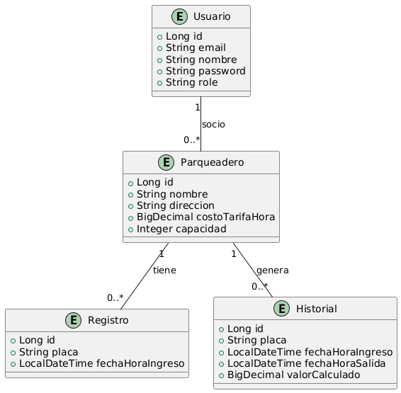

# **RETO NELUMBO BACKEND**

Este documento contiene toda la información necesaria para ejecutar, entender y probar el proyecto.

---

## **Índice**

1. [Cómo ejecutar el proyecto](#cómo-ejecutar-el-proyecto)  
   1.1 [Requisitos previos](#requisitos-previos)  
   1.2 [Comandos para ejecutar el proyecto](#comandos-para-ejecutar-el-proyecto)  
2. [Estructura del proyecto](#estructura-del-proyecto)  
   2.1 [Estructura de carpetas](#estructura-de-carpetas)  
   2.2 [Diagrama de base de datos](#diagrama-de-base-de-datos)  
3. [Rutas del proyecto](#rutas-del-proyecto)  
4. [Archivo POSTMAN](#archivo-postman)

---

## **1. Cómo ejecutar el proyecto**

### **1.1 Requisitos previos**

Antes de ejecutar el proyecto, asegúrate de tener instaladas las siguientes herramientas:

- **Java 17**  
- **Gradle 8.x**  
- **Docker y Docker Compose**  
- **PostgreSQL 15**  
- **Postman (opcional, para probar los endpoints)**

### **1.2 Comandos para ejecutar el proyecto**

1. **Clonar el repositorio**:

   ```bash
   git clone <URL_DEL_REPOSITORIO>
   cd <NOMBRE_DEL_PROYECTO>
   ```

3. **Iniciar el contenedor de la base de datos** (motor de base de datos - PostgreSQL):

   ```bash
   docker-compose up -d
   ```

4. **Ejecutar la aplicación: inicializa el proyecto y el microservicio de correos (modulos separados)**:

   ```bash
   ./gradlew :parqueadero:bootRun :email:bootRun
   ```

5. **Verificar que la aplicación esté corriendo** en:  
   `http://localhost:8080/status`
---

## **2. Estructura del proyecto**

### **2.1 Estructura de carpetas**

```plaintext
com.proyecto_nelumbo.pruebatecnica
├── config            # Clases de configuración (SEED data, RestTemplate bean)
├── controllers       # Controladores REST
├── dtos              # Clases DTO (Request y Response)
├── entities          # Entidades JPA (Tablas de la base de datos)
├── mappers           # Clases para mapear Entidades a DTOs y viceversa
├── repositories      # Interfaces de Repositorios JPA
├── security          # Configuración de seguridad (JWT, filtros, etc.)
├── services          # Clases de servicio con la lógica de negocio
└── PruebatecnicaApplication  # Clase principal de Spring Boot             # Configuración de contenedores Docker
```

### **2.2 Diagrama de base de datos**

El siguiente diagrama muestra la estructura de las tablas de la base de datos, incluyendo sus relaciones:

## Diagrama Entidad-Relación


---

## **3. Rutas del proyecto**

### **Endpoints principales**

## Endpoints del proyecto

### **Endpoints para el usuario ADMIN**

| Método | Descripción                                                                       | URL                                                                         |
|--------|-----------------------------------------------------------------------------------|-----------------------------------------------------------------------------|
| POST   | Crear usuarios con rol SOCIO                                                     | `http://localhost:8080/usuarios/socios`                                     |
| POST   | Crear un parqueadero                                                             | `http://localhost:8080/parqueaderos`                                        |
| PUT    | Asignar un socio a un parqueadero                                                | `http://localhost:8080/parqueaderos/{parqueaderId}/asociar-socio/{socioId}` |
| GET    | Revisar listado de vehículos en un parqueadero específico                        | `http://localhost:8080/parqueaderos/{parqueaderoId}/listar-registros`       |
| GET    | Top 3 de los socios con más ingresos de vehículos en la semana actual            | `http://localhost:8080/indicadores/top-socios-ingresos-semana`              |

---

### **Endpoints para el usuario SOCIO**

| Método | Descripción                                                                       | URL                                                                    |
|--------|-----------------------------------------------------------------------------------|------------------------------------------------------------------------|
| POST   | Registrar entrada de vehículos en un parqueadero                                 | `http://localhost:8080/parqueaderos/{parqueaderoId}/registrar-ingreso` |
| POST   | Registrar salida de un vehículo en un parqueadero                                | `http://localhost:8080/parqueaderos/{parqueaderoId}/registrar-salida`  |
| GET    | Ver el listado de los parqueaderos asociados al socio                            | `http://localhost:8080/parqueaderos/mis-parqueaderos`                  |
| GET    | Ver el listado de vehículos en un parqueadero                                    | `http://localhost:8080/parqueaderos/{parqueaderoId}/listar-registros`  |

---

### **Endpoints para indicadores (disponibles para ADMIN y SOCIO)**

| Método | Descripción                                                                       | URL                                                                       |
|--------|-----------------------------------------------------------------------------------|---------------------------------------------------------------------------|
| GET    | Top 10 vehículos que más veces se han registrado en los diferentes parqueaderos  | `http://localhost:8080/indicadores/top-vehiculos`                         |
| GET    | Top 10 vehículos que más se han registrado en un parqueadero                     | `http://localhost:8080/indicadores/top-vehiculos/{parqueaderoId}`         |
| GET    | Verificar cuáles de los vehículos están por primera vez en el parqueadero        | `http://localhost:8080/indicadores/vehiculos-primera-vez/{parqueaderoId}` |
| GET    | Obtener ganancias de hoy, semana, mes y año de un parqueadero                   | `http://localhost:8080/indicadores/ganancias/{parqueaderoId}?periodo=mes` |
| GET    | Top 3 de los vehículos con más ingresos en la semana actual                     | `http://localhost:8080/indicadores/top-socios-ingresos-semana`            |
---

## **4. Archivo POSTMAN**

Para facilitar las pruebas de los endpoints, se incluye un archivo de colección de **Postman** con todas las rutas configuradas.

1. Descarga el archivo de la colección [aquí](./postman_collection.json).
2. Importa el archivo en Postman:
   - Abre Postman.
   - Haz clic en **Import** y selecciona el archivo descargado.
3. Configura la variable de entorno `base_url` en Postman:
   - `base_url`: `http://localhost:8080`

---

### **Notas adicionales**

- Recuerda configurar las credenciales de acceso en Postman (usuario y contraseña) al probar los endpoints que requieren autenticación.
- La autenticación se realiza mediante un token JWT que debe incluirse en el header `Authorization` con el formato `Bearer <token>`.

---

Si tienes alguna pregunta o problema, no dudes en escribirme al siguiente correo: [jhoansebastianperez73@gmail.com](mailto:jhoansebastianperez73@gmail.com)
